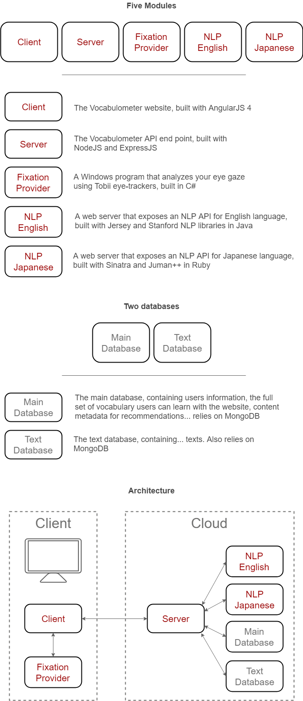
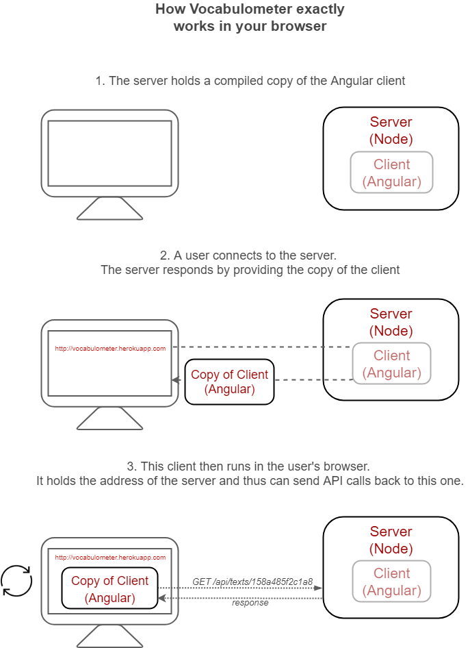
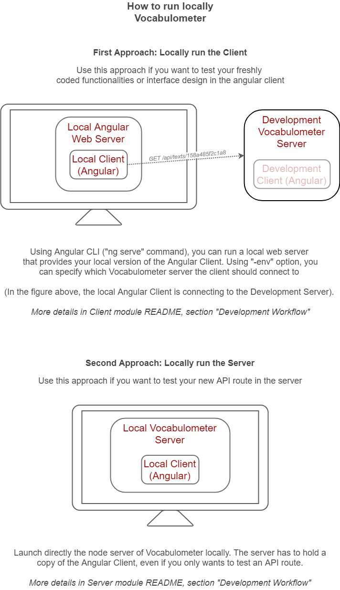

# About Vocabulometer

Vocabulometer is a website that helps you learn English or Japanese. 

Unlike other language learning apps or websites, Vocabulometer offers you texts to read 
according to your vocabulary knowledge, and also analyzes your reading activity to catch 
words you read. The system grows in the same time as your vocabulary improves. 
This way, Vocabulometer is always providing you with the texts that will help you progress.

# Technology stack

## Overview

<p align="center">
  
</p>

## Focusing on Client / Server communications

Vocabulometer architecture mainly consists into two modules:
 * The Angular Client
 * The NodeJS Server
 
Think of the Angular Client as the whole Vocabulometer website, containing all the HTML,
CSS and JS files. The Angular Client can run independently, without any NodeJS server, but
will be severally limited, as it has no access to the database.

The NodeJS Server is there for that purpose, to offer an API for tasks such as users login,
retrieving a text from the database or recommendations, that the Client cannot perform alone.

The basic process is that the Client runs in your browser, and sends API calls whenever a
server's task is needed.

<p align="center">
  
</p>

# Setup

## Dependencies

(Each version between parenthesis is the version I use. If you try with the newest ones it will most probably work too)

Dependencies with a (\*) prepended to their name have an installation guide written below. The installation of the other
dependencies is not explained.


### For deployment
 - Git (2.7.4)
 - Docker (18.03.1-ce)
 - \* Heroku CLI (7.7.10)
 - Gulp CLI (2.0.1)

### For running the modules
 - NodeJS (8.11.3) + NPM (6.3.0)  **[client, server]**
 - Angular CLI (6.1.2)			   **[client]**
 - Ruby (2.5.1p57) + Gem (2.7.7)  **[nlp-jp]**
 - CMake (3.5.1)                  **[nlp-jp]**
 - \* JumanPP (2.0.0-rc2)			   **[nlp-jp]**
 - \* Bundler (1.16.3)               **[nlp-jp]**
 - Maven (3.3.9)				   **[nlp-en]**
 - JRE + JDK (1.8.0_181)		   **[nlp-en]**

## Environment variables
Please set those environment variables according to your setup.

 - ```JAVA_HOME```
 - ```MAVEN_HOME```

## Installation of the dependencies

### Install Heroku CLI
Only run ```npm i``` if you have never run it in ```deploy``` directory.

    cd deploy/
    npm i                # Skip if you have already done it
    gulp heroku:install
    gulp heroku:login
    gulp heroku:container-login

### Install Bundler
First install ```Ruby``` with ```Gem```, and then

    gem install bundler

### Install JumanPP
For installing ```jumanpp``` you need to install first ```cmake``` and ```bundler```. You also need the apt package ```build-essential```
if you are on Ubuntu or Debian.

    sudo apt-get update
    sudo apt-get install build-essential cmake
    mkdir tmp && cd tmp/
    wget https://github.com/ku-nlp/jumanpp/releases/download/v2.0.0-rc2/jumanpp-2.0.0-rc2.tar.xz
    tar xvf jumanpp-2.0.0-rc2.tar.xz
    mkdir jumanpp-2.0.0-rc2/build && cd jumanpp-2.0.0-rc2/build
    cmake ../ 
    make -j 8
    sudo make install
    
You can then delete the created folder ```tmp```.


## Testing your changes

<p align="center">
  
</p>

# Credits


This project has been mainly developed by Clément Jacquet, during his M1 and M2 internships
at the IMP laboratory, Osaka Prefecture University. The development and research surrounding
Vocabulometer has been supervised by Olivier Augereau (Osaka Prefecture University) and 
Nicholas Journet (LaBRI). Credits go to Anne-Gaëlle Schall and David Pignato for their work 
on real-time reading detection and the implementation of a Spaced Repetition System respectively.